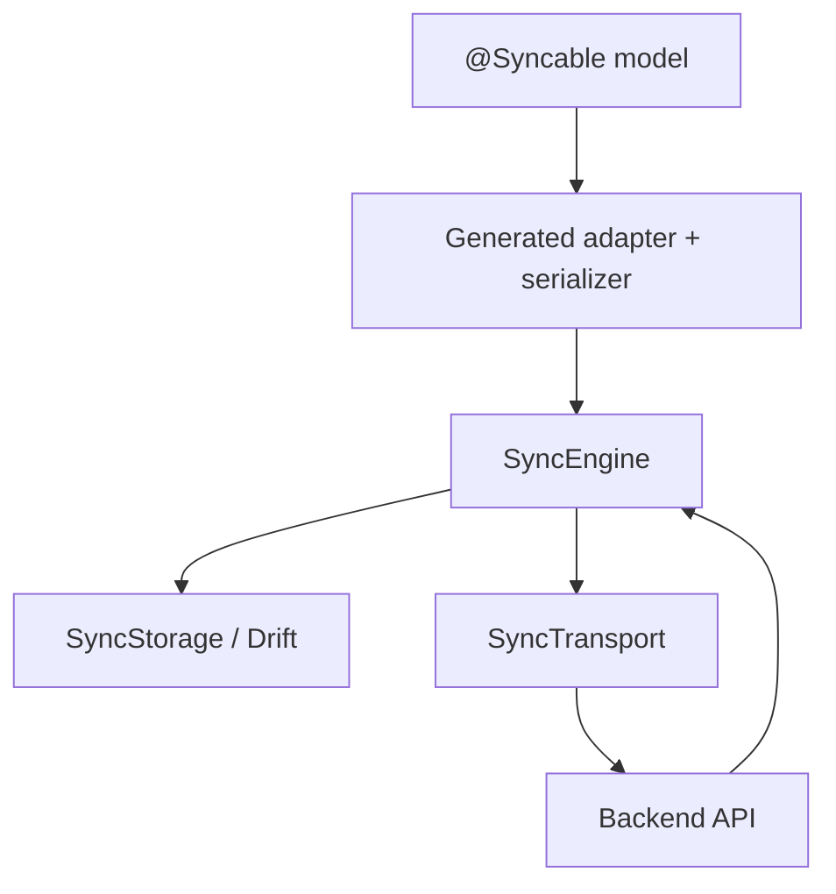

# SyncForge

> Offline-first synchronization for Flutter apps that need durable writes, deterministic conflict resolution, and generated adapters.

[](https://github.com/Wolfof420Street/flutter_sync_engine/actions/workflows/test.yml)
[](LICENSE)
[](https://pub.dev/packages/sync_engine)

SyncForge is a backend-agnostic offline synchronization framework for Flutter applications. It combines CRDT-based conflict resolution, vector clocks, optimistic local updates, code generation, and pluggable storage and transport adapters to simplify building resilient offline-first products.

The synchronization engine is implemented in pure Dart, making it portable, testable, and independent of Flutter.

## Project Links

- [Core package](packages/sync_engine/README.md)
- [Drift adapter](packages/sync_engine_drift/README.md)
- [Generator package](packages/sync_engine_generator/README.md)
- [Architecture](ARCHITECTURE.md)
- [Sync protocol](docs/SYNC_PROTOCOL.md)
- [Contributing](CONTRIBUTING.md)
- [Support policy](SUPPORTED_VERSIONS.md)
- [Security](SECURITY.md)

---

## Hero



---

## Why SyncForge

SyncForge is designed for teams that want the control of a custom sync stack without the maintenance burden of building one from scratch.

- Durable local writes that survive restarts
- Deterministic merge behavior for concurrent edits
- A generated adapter layer instead of handwritten serialization glue
- A Drift-backed storage path for real offline persistence
- A transport abstraction that works with REST-style backends and custom APIs
- Clear protocol docs so sync behavior is explainable, testable, and supportable

---

## Architecture

```text
@Syncable models
      │
      ▼
Generated adapters and serializers
      │
      ▼
SyncEngine
   ├── SyncStorage      → Drift-backed persistence
   └── SyncTransport    → REST, GraphQL, custom backend
```

SyncForge separates synchronization logic from storage and networking, allowing applications to integrate with existing backends without changing the synchronization engine.

---

## Who It Is For

- Solo Flutter developers who need offline writes without inventing a sync protocol.
- Product teams building note, task, field service, or collaboration apps.
- Enterprise apps that need deterministic recovery, auditability, and restart-safe persistence.

---

## Quick Start

1. Define a synchronizable model:

```dart
@Syncable()
class Todo {
  const Todo({
    required this.id,
    required this.title,
  });

  @Id()
  final String id;

  @ConflictStrategy(ConflictType.lastWriteWins)
  final String title;
}
```

2. Generate the synchronization code:

```bash
flutter pub get
flutter pub run build_runner build --delete-conflicting-outputs
```

3. Create a `SyncEngine` instance:

```dart
final sync = SyncEngine(
  storage: storage,
  transport: transport,
  nodeId: "device-a",
  adapters: {
    Todo: const TodoSyncAdapter(),
  },
);
```

---

## Features

- Offline-first architecture
- Pure Dart CRDT engine
- Vector clock–based causal ordering
- Per-field conflict resolution
- Optimistic writes with automatic rollback
- Durable outbox with retry and dead-letter handling via the Drift adapter
- Tombstone-based deletion support
- Annotation-driven code generation
- Generator-time rejection of unsupported custom merge strategies
- Drift storage adapter
- Backend-agnostic transport abstraction
- Comprehensive property-based and convergence testing

---

## Packages

### `sync_engine`

The core synchronization library implemented in pure Dart.

Includes:

- Vector clocks
- CRDT implementations
- Synchronization protocol
- Optimistic write pipeline
- Conflict resolution
- Serialized sync execution and cursor validation
- Public synchronization API

---

### `sync_engine_generator`

Code generation using `build_runner`.

Generates:

- Sync adapters
- Serializers
- Merge logic
- Adapter registry

Unsupported `ConflictType.custom` fields fail generation instead of crashing at runtime.

---

### `sync_engine_drift`

A production-ready Drift storage implementation featuring:

- Durable persistence
- Tombstones
- Acknowledgements
- Frontier pruning
- Schema versioning
- Durable outbox persistence with retry metadata and dead letters

---

## Examples

The repository includes several example applications, each optimized for a different stage of adoption.

| Example | Description |
|---------|-------------|
| `minimal_app` | Smallest possible integration path |
| `notes_app` | External consumer example with persisted local state |
| `task_manager` | Full-featured production-style synchronization example |
| `conflict_playground` | Interactive visualization of concurrent conflict resolution |

Start with:

1. [minimal_app](example/minimal_app/README.md) for a five-minute integration.
2. [notes_app](example/notes_app/README.md) for a consumer-owned app structure.
3. [task_manager](example/task_manager/README.md) for transport and retry behavior.
4. [conflict_playground](example/conflict_playground/README.md) for a live merge demo.

---

## Conflict Resolution

SyncForge combines multiple conflict-resolution strategies.

- **Vector clocks** provide causal ordering.
- **Per-field Last-Write-Wins (LWW)** resolves concurrent edits independently for each field.
- **GCounter** provides monotonic distributed counters.
- **GSet** provides grow-only replicated sets.
- **Tombstones** ensure deletes converge correctly across replicas.

This design allows unrelated concurrent edits to be preserved while maintaining deterministic convergence.

Further details are available in:

- `docs/SYNC_PROTOCOL.md`
- `packages/sync_engine_drift/DESIGN.md`

---

## Performance

SyncForge is designed to scale from a handful of offline writes to large queues and repeated reconnect cycles. The repository validates the sync path, generator output, durable outbox behavior, and example-app workflows in CI.

For production evaluation, review:

- `packages/sync_engine/test/`
- `packages/sync_engine_drift/test/`
- `packages/sync_engine_generator/test/`
- `example/task_manager/test/`
- `example/notes_app/test/`

---

## Comparison

| Capability | SyncForge | Hand-rolled sync | Backend SDK only | Local cache only |
|---|---|---|---|---|
| Offline writes | Yes | Usually partial | Usually no | Yes |
| Durable outbox | Yes | Rarely | No | No |
| Deterministic conflict handling | Yes | Varies | Varies | No |
| Generated adapters | Yes | No | No | No |
| Drift-backed persistence | Yes | Possible | No | Yes |
| Protocol documentation | Yes | Usually no | Usually no | No |

---

## Testing

The project includes extensive automated verification:

- Unit tests
- Integration tests
- Property-based CRDT verification
- Replica convergence testing
- Generator fixture validation
- Widget tests
- External consumer integration tests

Randomized property tests verify CRDT correctness across thousands of merge scenarios.

---

## Development

```bash
dart pub global activate melos 2.9.0

melos bootstrap
melos run generate
melos run analyze
melos run test
```

---

## FAQ

**Does SyncForge replace my backend?**
No. It coordinates local synchronization and transport, but your backend still owns authentication, authorization, and server-side data rules.

**Can I use a custom backend?**
Yes. Implement `SyncTransport` for your API shape.

**Do I have to use Drift?**
No. Drift is the production storage adapter included in this repository, but the core engine is storage-agnostic.

**Can I customize conflict resolution?**
Yes for supported strategies. Unsupported custom merge behavior is rejected at generation time rather than failing at runtime.

---

## Documentation

- `docs/SYNC_PROTOCOL.md` — Synchronization protocol specification
- `ARCHITECTURE.md` — System architecture
- `docs/CONTRIBUTING.md` — Contribution guidelines
- `docs/RELEASE_CHECKLIST.md` — Release process
- `packages/sync_engine_drift/DESIGN.md` — Drift implementation details
- `SUPPORTED_VERSIONS.md` — Supported runtime and maintenance policy
- `SECURITY.md` — Security reporting guidance
- `CODE_OF_CONDUCT.md` — Community standards

---

## Need Help?

If you are evaluating SyncForge for a production app:

1. Start with the [minimal example](example/minimal_app/README.md).
2. Read the [sync protocol](docs/SYNC_PROTOCOL.md).
3. Review the [task manager example](example/task_manager/README.md) for HTTP transport behavior.
4. See [BACKEND_INTEGRATION.md](docs/BACKEND_INTEGRATION.md) for adapter boundaries.

---

## Roadmap

The current codebase is production-ready for the supported core workflow. Future work centers on additional storage adapters, transport integrations, observability hooks, and richer enterprise deployment guidance.

---

## License

Released under the MIT License.
